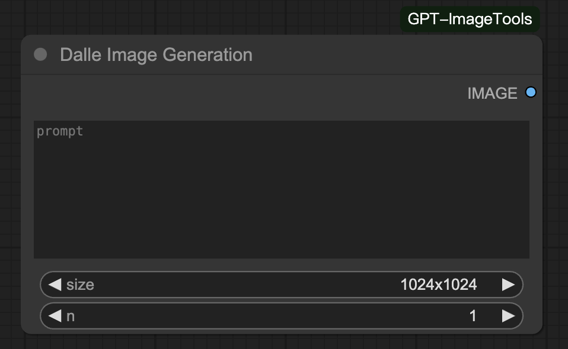
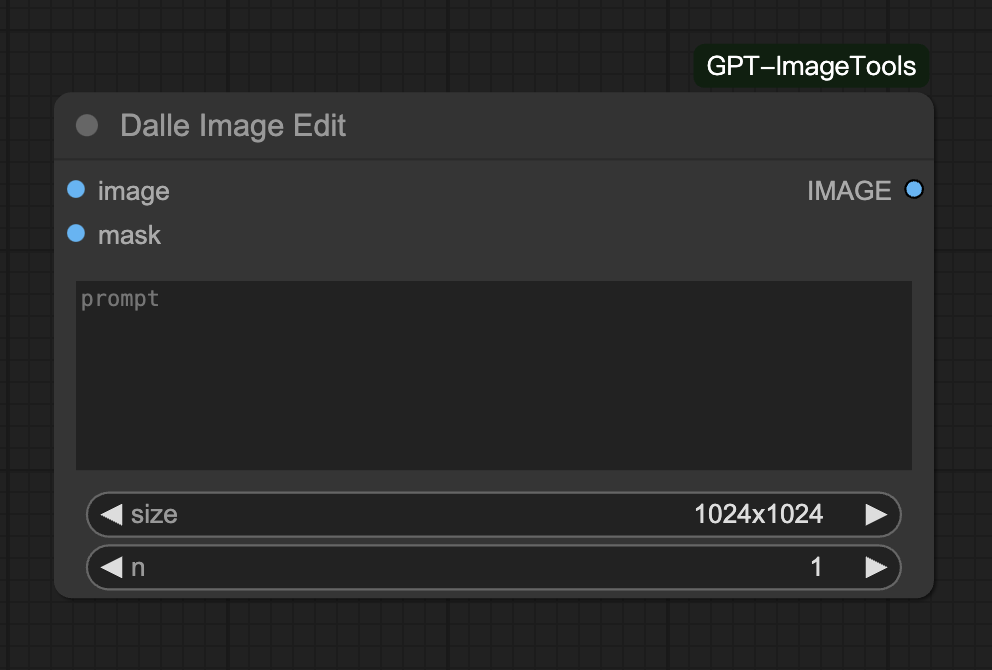
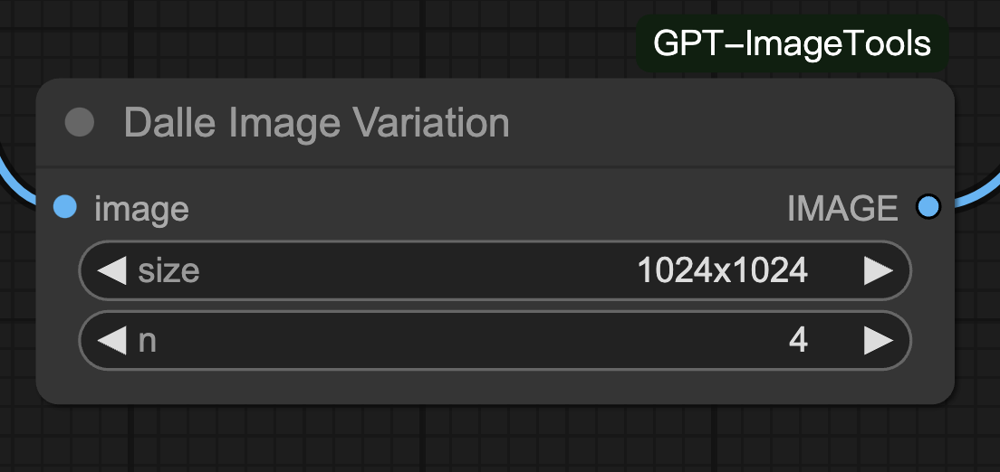
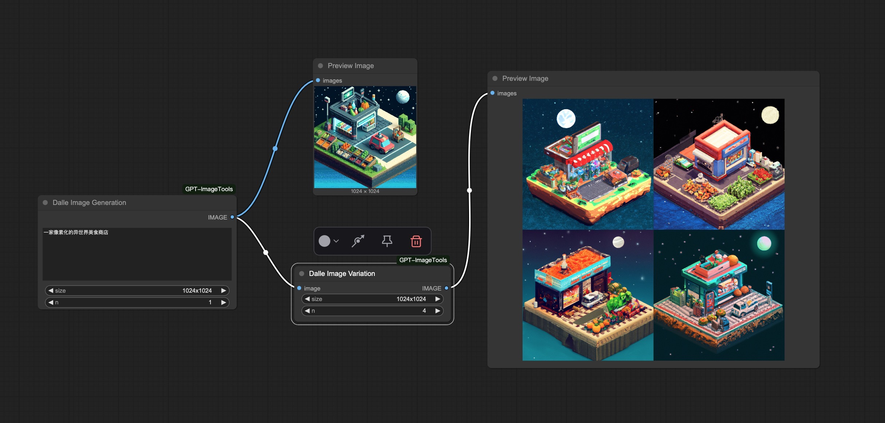
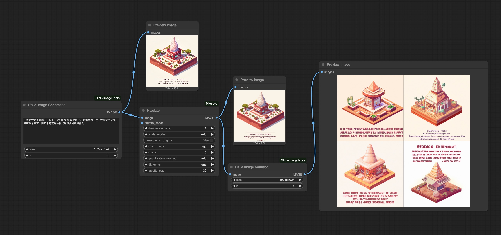

# DalleImageNodes - OpenAI DALL·E Nodes for ComfyUI

## Overview

DalleImageNodes is a custom extension for [ComfyUI](https://github.com/comfyanonymous/ComfyUI) that integrates OpenAI's DALL·E 3 API for:

- Image generation
- Inpainting (image editing)
- Image variation

This project supports the latest OpenAI Python SDK (v1.x) and automatically handles image resizing and format requirements (RGBA, fixed sizes) based on the examples from the offical Dall-E website.

---

## Node Previews

### Image Generation


### Image Editing


### Image Variation


---

## Output Examples

### Example 1


### Example 2


---

## Installation

1. Copy `DalleImageNodes_async_final.py` into any folder under your `ComfyUI/custom_nodes/` directory.
2. Restart ComfyUI.

---

## Configuration

Create a `config.json` file in the same folder as the `.py` node file:

```json
{
  "openAI_API_Key": "your-api-key"
}
```

This file is required for authentication with OpenAI's API.

---

## Features

- Text-to-image generation using DALL·E 3
- Inpainting with prompt and mask
- Image variation support
- Automatic RGBA conversion and resizing
- Batch generation
- Fully async (based on `AsyncOpenAI`)

---

## License

MIT License.
